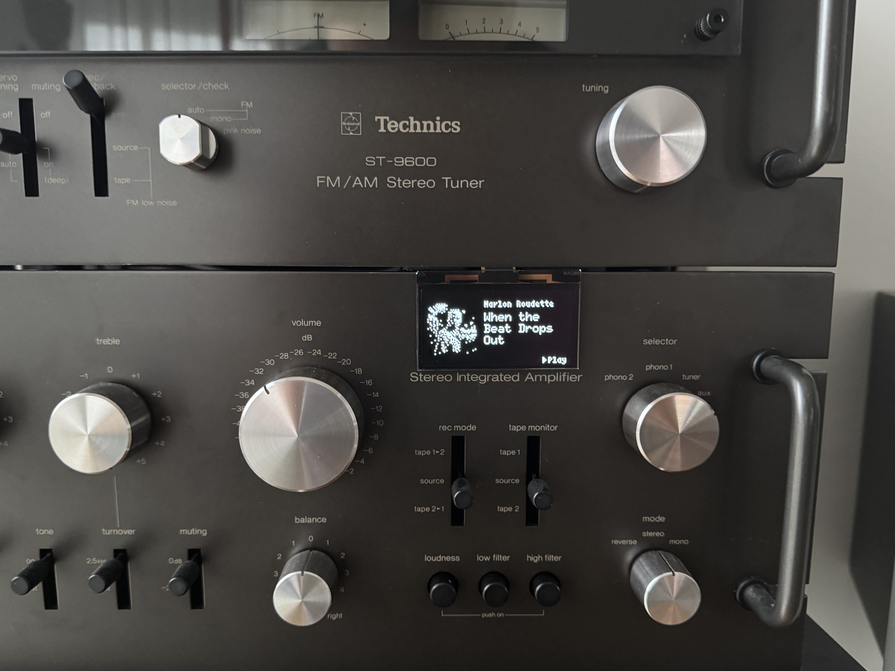
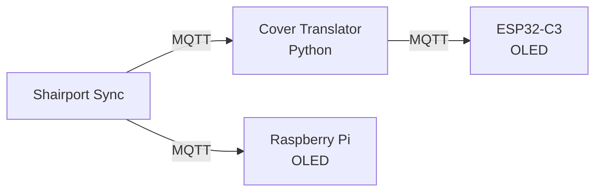

# OLED Media Display



Display media player metadata (artist, title, cover art) from Shairport Sync via MQTT on 128x64px OLED displays.

## Features

- Shows artist and title
- Displays cover art in 48x48px monochrome
- Auto-scrolling for long titles (Python version)
- Starfield animation when idle (Python version)
- Auto-sleep after 5 minutes inactivity
- OTA updates (ESP32)
- Works with Raspberry Pi and ESP32-C3 (SSD1306, SSD1309, SH1106)

## Components

### 1. Raspberry Pi / SH1106 Display (`main.py`)

Python script for SH1106 OLED (128x64) connected via I2C.

**Environment Variables:**
| Variable | Default | Description |
|----------|---------|-------------|
| `MQTT_BROKER` | `localhost` | MQTT broker hostname |
| `MQTT_PORT` | `1883` | MQTT broker port |
| `MQTT_USER` | | MQTT username |
| `MQTT_PASS` | | MQTT password |
| `MQTT_TOPIC_BASE` | `iotstack/shairport` | Base topic for metadata |

**Run as service:**
```bash
sudo cp oled-mediaplayer.service /etc/systemd/system/
sudo systemctl enable --now oled-mediaplayer
```

---

### 2. ESP32-C3 / SSD1309 Display (`esp32-c3/`)

Arduino firmware for ESP32-C3 with SSD1309 OLED (128x64) supporting OTA updates and MQTT control.

**Setup:**
1. Copy `credentials.example.h` → `credentials.h` and fill in WiFi and MQTT details
2. Flash via Arduino IDE or PlatformIO

**Pins (for ESP32-C3 super mini):**
| Pin | Function |
|-----|----------|
| GPIO 8 | I2C SDA |
| GPIO 9 | I2C SCL |

---

### 3. MQTT Cover Translator (`esp32-c3/mqtt_cover_translator.py`)

Converts Shairport cover images to 48x48 monochrome bitmaps for the ESP32 display and repeats all incoming traffic with retain=True flag.

**Run as service:**
```bash
sudo cp esp32-c3/mediaplayer-mqtt-translator.service /etc/systemd/system/
sudo systemctl enable --now mediaplayer-mqtt-translator
```

**Environment Variables:**
| Variable | Default | Description |
|----------|---------|-------------|
| `MQTT_TOPIC_IN` | `iotstack/shairport/#` | Source topic (Shairport) |
| `MQTT_TOPIC_OUT` | `iotstack/shairport-extension` | Output topic for ESP32 |

## Architecture

